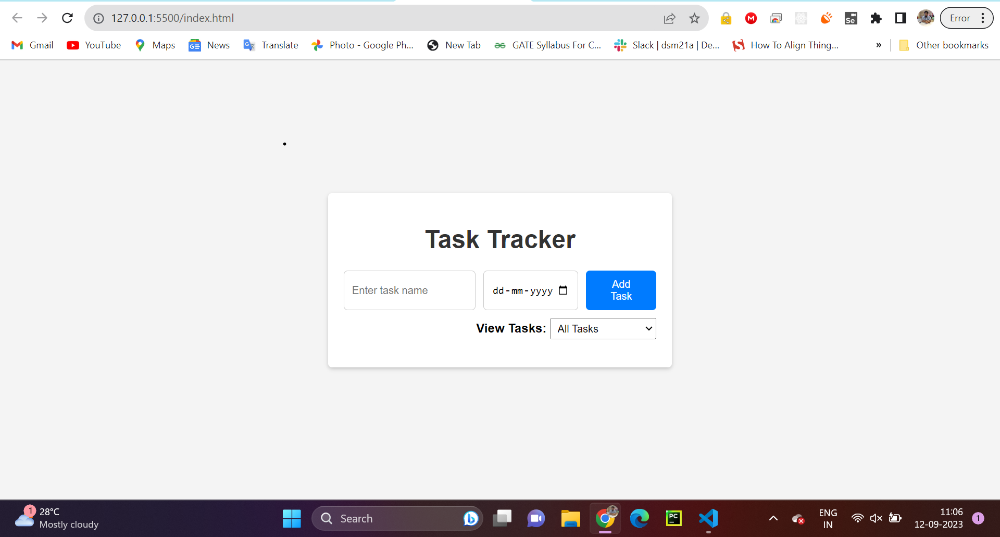

# Task Tracker Web App

A simple web application for tracking tasks, built using HTML, CSS, and JavaScript. This project demonstrates the use of classes, switch statements, and try-catch-finally statements in a web development context.



## Features

- Add tasks with a name and due date.
- Mark tasks as completed or pending.
- Filter tasks by their completion status (All Tasks, Completed Tasks, Pending Tasks).

## Prerequisites

- Modern web browser (Google Chrome, Mozilla Firefox, etc.).

## Getting Started

1. Clone the repository to your local machine:

```bash  
git clone https://github.com/your-username/task-tracker.git  
```  

2. Navigate to the project directory:

```bash  
cd task-tracker  
```  

3. Open index.html in your web browser to run the Task Tracker application.

## Usage
* Adding a Task:  
    * Enter the task name in the "Enter task name" input field.  
    * Choose the due date using the date picker.
    * Click the "Add Task" button to add the task to the list.  

* Viewing Tasks:  
    * Use the "View Tasks" dropdown to select one of the following views:  
        * "All Tasks": Displays all tasks.  
        * "Completed Tasks": Shows completed tasks only.  
        * "Pending Tasks": Lists pending tasks only.  

* Marking Tasks as Completed:  
    * Click on a pending task to mark it as completed. Click again to mark it as pending.  

* Contributing  
    If you'd like to contribute to this project, please follow these guidelines:  

    1. Fork the project.  
    2. Create your feature branch: git checkout -b feature/new-feature.  
    3. Commit your changes: git commit -m 'Add a new feature'.  
    4. Push to the feature branch: git push origin feature/new-feature.  
    5. Open a pull request.  
